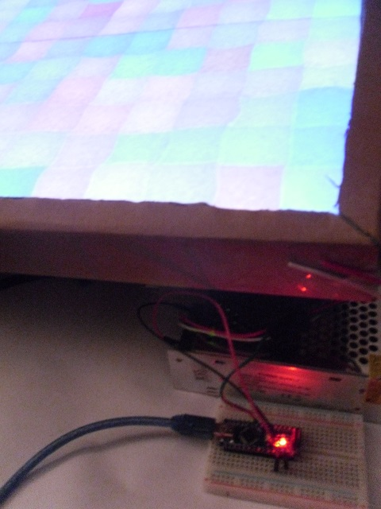
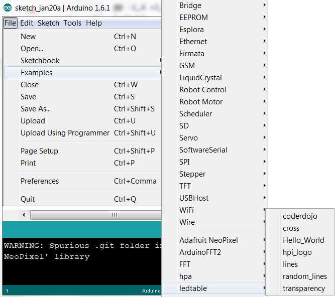

Libraries
=========

These libraries should be added to your Arduino folder.
If you just want to have a look around, you can view the [ledtable](ledtable) library.

Installation
------------

1. Download the libraries

    - You can download the using the `git` command in the terminal.
  
            git clone --depth 1 https://github.com/niccokunzmann/ledtable.git
            cd ledtable
            git submodule init
            git submodule update

    - You can download the zip files.
    
	    - [ledtable](https://github.com/niccokunzmann/ledtable/archive/master.zip) - the libraries are in `ledtable-master\arduino\libraries`
	    - [Adafruit Neopixel](https://github.com/adafruit/Adafruit_NeoPixel/archive/master.zip)

2. [Install the libraries](https://www.arduino.cc/en/Guide/Libraries).
3. Reopen your Arduino IDE so it lists the libraries.
4. You should be able to see the examples.
    
