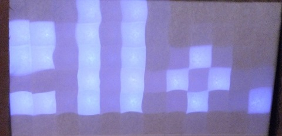

Hello_World
===========

[This example](Hello_World.ino) shows text on the display. You can change `"Hello, World!"` to `"Hello,\nWorld!"` to display two lines of text. The letters can be found in [`../../text.cpp`](../../text.cpp). You can change then by setting the values of `characterToPixels`. The following line can be placed in `setup()` and changes the character `'A'`

                             //x1111122222333334444455555
    characterToPixels['A'] = 0b1111111010011111;
    //1   11111  rotate  1 1 1  =>  A A A
    //    10100    =>    1 0 1  =>  A   A
    //    11111          1 1 1  =>  A A A
    //                   1 0 1  =>  A   A
    //                   1 0 1  =>  A   A

