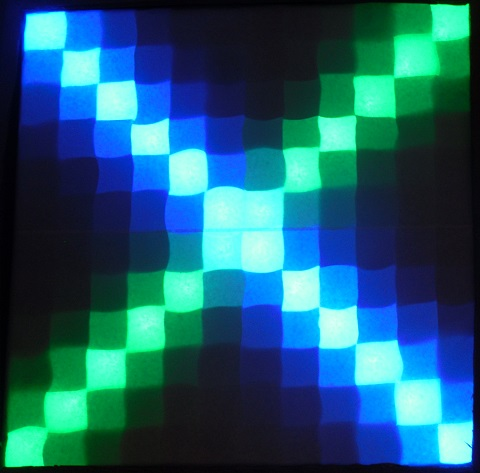
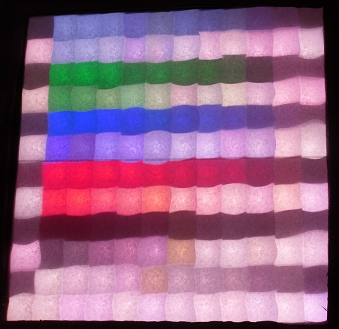

Examples
========

  
Use `for` loops to set pixels on the screen.

  
You can create lines.

  
Learn how to create circles and change the picture based on existing colors.

  
Write text on the screen. You can also move the text.

  
With stamps you can put any form in any color onto the screen with only a few lines.

  
Create lines of random color at random positions.

  
You can use transparency to mix colors.

