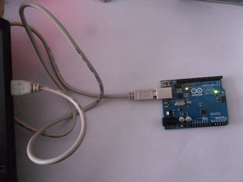
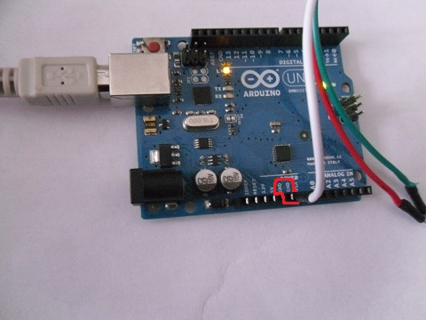
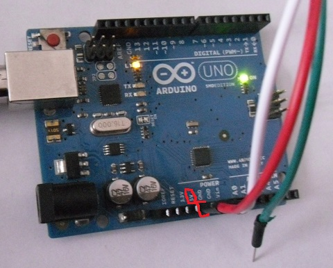
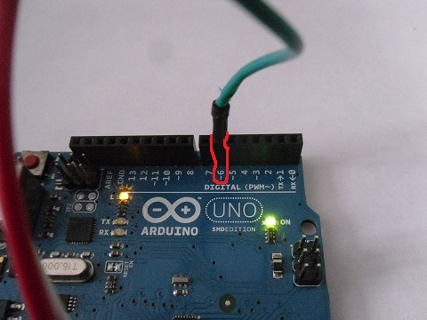

Der Anfang
==========

Diese Tutorial zeigt dir, wie Du den Arduino benutzt, um einen LED-Tisch zu steuern.

Installation
------------

Unter Windows, Mac und Linux: Lade Dir die Arduino Software von [www.arduino.cc/en/Main/Software](https://www.arduino.cc/en/Main/Software) herunter und installiere sie. 

Unter Linux gibt es auch alte Versionen im Softwarecenter. Diese kann man z.B. mit `sudo apt-get install arduino` installieren.

Anschließen
-----------

Wenn Du den LED-Tisch benutzen möchtest, musst du ihn zuerst anschließen.

1. Schließe den Arduino per USB an den Rechner an. Er sollte jetzt leuchten. 
2. Verbinde das weiße Kabel vom LED-Tisch mit dem Pin "GND" der Arduino. "GND" heißt Ground, was auf Deutsch Masse bedeutet. Dort fließt der Strom hin. 
3. Verbinde das Rote Kabel mit 5V. Dort liegt Spannung 
4. Verbinde das Grüne Kabel mit dem Pin "6". Dieser kann auch "D6" oder "~6" heißen. Das ist das Detenkabel, über das der Arduino dem LED-Table sagt, welche Farben gezeigt werden sollen. 

Fertig, jetzt sollten schon Beispielprogramme geladen werden können.

Eigene Programme schreiben
--------------------------

