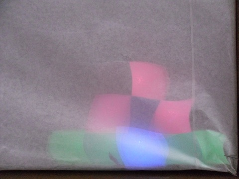

Der Anfang
==========

Diese Tutorial zeigt dir, wie Du den Arduino benutzt, um einen LED-Tisch zu steuern.

Installation
------------

Es müssen mehrere Sachen auf dem Rechner installiert werden, um Arduinoprogramme für den LED-Tisch zu schreiben.

### Arduino

Um Programme auf Arduinos zu laden, braucht man die Arduino Software.

Unter Windows, Mac und Linux: Lade Dir die Arduino Software von [www.arduino.cc/en/Main/Software](https://www.arduino.cc/en/Main/Software) herunter und installiere sie. 

Unter Linux gibt es auch alte Versionen im Softwarecenter. Diese kann man z.B. mit `sudo apt-get install arduino` installieren.

### ledtable

Um LED-Tische zu programmieren, kann man die `ledtable`-Bibliothek für den Arduino benutzen. Eine Installationsanleitung befindet sich [hier](../../../).

Anschließen
-----------

Wenn Du den LED-Tisch benutzen möchtest, musst du ihn zuerst anschließen.

1. Schließe den Arduino per USB an den Rechner an. Er sollte jetzt leuchten. 

    

2. Verbinde das weiße Kabel vom LED-Tisch mit dem Pin "GND" der Arduino. "GND" heißt Ground, was auf Deutsch Masse bedeutet. Dort fließt der Strom hin.  

    

3. Verbinde das Rote Kabel mit 5V, um den LED-Tisch mit Strom zu versorgen. 

    

4. Verbinde das Grüne Kabel mit dem Pin "6". Dieser kann auch "D6" oder "~6" heißen. Das ist das Detenkabel, über das der Arduino dem LED-Table sagt, welche Farben gezeigt werden sollen.  

    

Fertig, jetzt sollten schon Beispielprogramme geladen werden können.

Eigene Programme schreiben
--------------------------

Jetzt bist du bereit, ein Programm zu schreiben. Öffne die Datei [`de_01_tutorial.ino`](de_01_tutorial.ino?raw=true) mit der Arduino Software. Diese sollte sich in den Beispielen der Library befinden. Dazu:

1. Öffne das Arduino Programm. 
2. Klicke "Datei" ("File")
3. Klicke "Beispiele" ("Examples")
4. Klicke "ledtable" weiter unten.
5. Klicke `de_01_tutorial`.

Das solltest du lesen. Die wichtigsten Sachen, wo was zu tun ist, sind mit `(!)` in der Datei gekennzeichnet.

Danach sollte der LED-Tisch etwas Schöneres als das anzeigen:  
