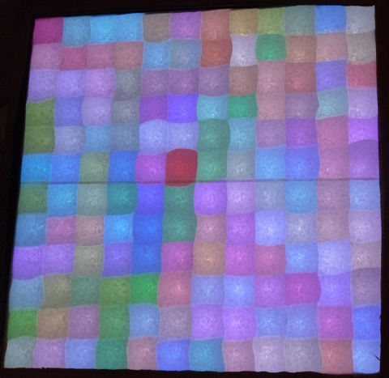

random_lines
============

[This example](random_lines.ino) draws random lines all over the screen. They are a bit transparent. In the process all pixels get their unique color. It is a showcase of randomness, line drawing and color mixing.

