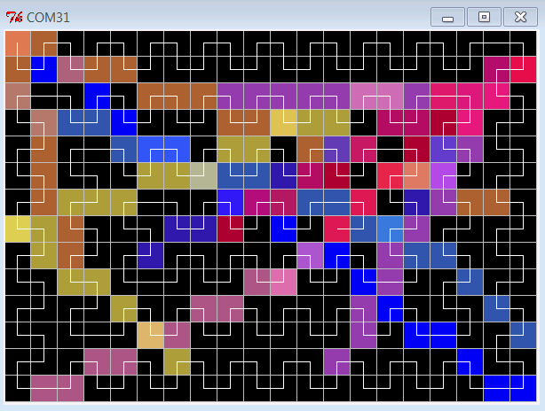

# ledtable

This Python library can be used to accompany the development of LEDTable software on the Arduino.

You can run 

    pip install ledtable
    python -m ledtable.SerialLEDTable <ArduinoSerialPort> <baudrate>

Which opens the window that shows you LEDTable:

It works under Python 2 and Python 3.
On the Arduino, the methods

	LEDTable::printToSerial()
    LEDTable::printPixelOrderToSerial()

can be used to update the LEDTable.